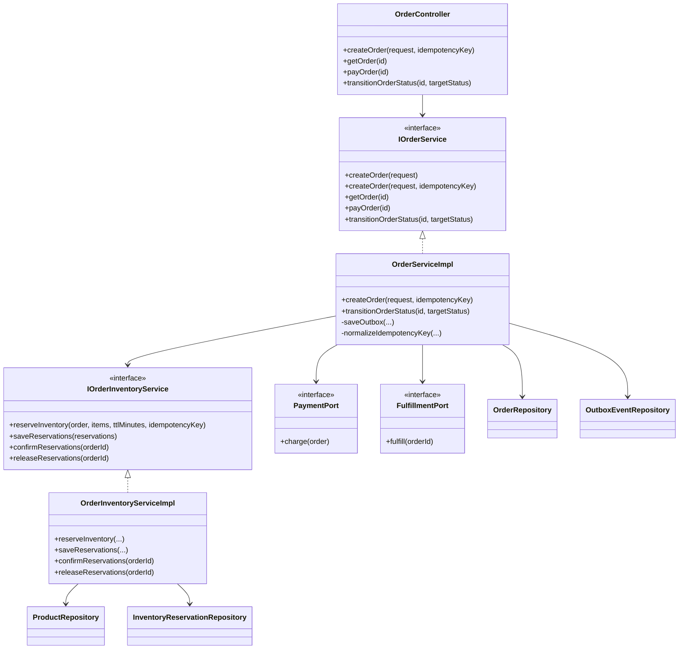
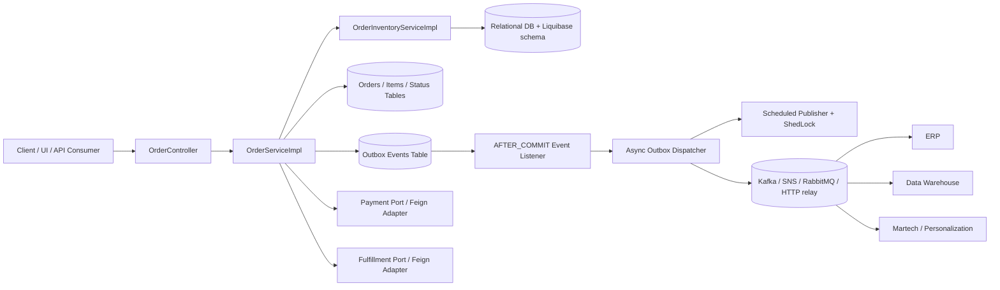

# Order API
A lean, production-leaning Spring Boot 3.5 / Java 21 order-management service for a small retail ordering flow, with hardened concurrency handling, policy-driven state transitions, idempotent create-order support, and an outbox-based integration pattern.
## Table of Contents
- [What this project does](#what-this-project-does)
- [Core capabilities](#core-capabilities)
- [Architecture overview](#architecture-overview)
- [UML diagram](#uml-diagram)
- [System diagram](#system-diagram)
- [Data model and state management](#data-model-and-state-management)
- [Additional requirement: scale to 500000 daily orders](#additional-requirement-scale-to-500000-daily-orders)
- [Downstream integration strategy](#downstream-integration-strategy)
- [Testing strategy](#testing-strategy)
- [Runnable code and setup instructions](#runnable-code-and-setup-instructions)
- [Assumptions](#assumptions)
- [Trade-offs](#trade-offs)
- [Out of scope](#out-of-scope)
## What this project does
This service provides a compact order lifecycle while keeping the critical paths production-ready:
- Create orders from a seeded product catalog.
- Retrieve orders by ID.
- Transition orders through DB-driven policy rules.
- Reserve and release inventory safely under concurrency.
- Persist outbox events for asynchronous downstream delivery.
- Integrate with payment and fulfillment systems through outbound ports.
The solution intentionally keeps the domain small, but the internals are designed as a foundation that can evolve to higher scale.
## Core capabilities
### Public API
Base path: `/api/v1/orders`
1. `POST /api/v1/orders`
   - Create an order.
   - Supports optional `Idempotency-Key` header.
   - Also supports client-supplied `orderId` as a dedupe key.
2. `GET /api/v1/orders/{id}`
   - Fetch an order by ID.
3. `POST /api/v1/orders/{id}/pay`
   - Transition an order to `PAID`.
4. `POST /api/v1/orders/{id}/status/transition`
   - Generic transition endpoint.
   - Example payload:
   ```json
   { "targetStatus": "FULFILLED" }
   ```
### Operational behavior
- Inventory is decremented using atomic SQL updates.
- Reservations are persisted so inventory can be released on failures.
- Payment and fulfillment errors trigger compensation logic.
- Outbox rows are written in the same transaction as the business change.
- Outbox dispatch is triggered after commit and also backed by a scheduler for resilience.
## Architecture overview
This service follows a pragmatic hexagonal style:
- **Inbound adapter**: REST controller
- **Application services**: orchestration and use-case logic
- **Outbound ports**: payment, fulfillment, inventory policy
- **Outbound adapters**: Feign clients, JPA repositories, scheduled outbox publisher
### Key design choices
- **Application service orchestrates; specialized services do the work**
  - `OrderServiceImpl` coordinates use cases.
  - `OrderInventoryServiceImpl` owns inventory reservations/release behavior.
- **State is DB-driven**
  - Order status and allowed transitions are configured in tables.
- **Consistency first**
  - Inventory decrement and reservation rows are persisted atomically.
  - Outbox rows are durable before external publication.
- **Failure compensation**
  - Payment or fulfillment failure reverts stock.
  - Cancel transitions also release stock.
## UML diagram
Below is a simplified UML/class view of the main service boundaries.

## System diagram
This diagram shows the runtime flow and the asynchronous outbox path.

## Data model and state management
### Core entities
- `orders`
- `order_items`
- `products`
- `order_statuses`
- `order_item_statuses`
- `update_status_restriction`
- `inventory_reservations`
- `outbox_events`
- `shedlock`
### State handling
Order transitions are policy-driven:
- `PENDING`
- `PAID`
- `FULFILLED`
- `CANCELLED`
Allowed transitions are stored in `update_status_restriction`, which means business rules are data, not hard-coded logic.
### Inventory safety model
To avoid overselling under concurrency:
- inventory is decremented using an atomic SQL update
- stock reservations are persisted for each order item
- reservations can be confirmed or released later
- release is idempotent and runs in its own transaction
This gives correct behavior under multiple simultaneous requests without using JVM locks.
## Additional requirement: scale to 500,000 daily orders
If this solution must scale to **500,000 orders/day** with traffic spikes, the design should prioritize the following:
### 1) Keep the synchronous API path small
The API should do only the minimum work required to guarantee correctness:
- validate request
- enforce idempotency
- atomically reserve stock
- persist the order
- persist the outbox row
- return
Everything else should move out of the request thread.
### 2) Use the outbox as the integration backbone
The outbox pattern is the correct bridge between transactionally-safe database writes and asynchronous downstream systems.
Why this matters:
- avoids dual-write problems
- ensures reliable delivery after DB commit
- enables retries and replay
- allows multiple consumers without changing the order transaction
### 3) Partition work by aggregate/key
For high throughput and safe parallelism:
- partition by `orderId` or `aggregateId`
- preserve ordering for events from the same order
- scale consumers horizontally by partition count
### 4) Use backpressure-aware async publishing
Do not let event publication overload the API node.
Recommended approach:
- after-commit listener signals that work is available
- a dispatcher claims batches of rows
- workers publish in the background
- scheduler remains as a safety net
### 5) Separate hot paths from cold paths
Hot paths:
- create order
- pay order
- status transition
- inventory reserve/release
Cold paths:
- analytics export
- audit/log shipping
- reporting
- cache refresh
- notification delivery
### 6) Make compensation explicit
For payment or fulfillment failures:
- release stock via compensation
- emit a failure event
- optionally trigger refund flow if payment was captured
### 7) Database and operational considerations
At this scale, you should consider:
- proper indexes on order lookup and outbox processing columns
- connection pool sizing and timeouts
- read replicas for reporting and lookup-heavy workloads
- partitioning or archiving for outbox history
- dead-letter handling for unrecoverable events
## Downstream integration strategy
The domain must reliably serve multiple consumers:
### ERP
ERP systems usually need near-real-time operational events:
- order created
- payment confirmed
- order fulfilled
- order cancelled
Recommended integration:
- consume from the outbox-backed event stream
- idempotent consumer keyed by `orderId` + event type
- retry with DLQ on temporary failures
### Data Warehouse
The warehouse should be fed with immutable, replayable facts:
- order snapshots
- item-level facts
- status change history
- stock reservation/release history
Recommended integration:
- append-only event feed from the outbox stream
- CDC or batch extraction into the warehouse
- schema versioning for analytics compatibility
### Martech / personalization systems
Marketing and personalization systems usually need:
- order creation events
- product/category affinity signals
- purchase completion
- cancelled/abandoned order signals
Recommended integration:
- event stream fan-out from the same outbox feed
- enrichment layer before delivery
- customer-safe privacy filtering
### Reliability model for all consumers
To keep integrations reliable:
- outbox row is the source of truth for outbound events
- dispatcher retries with backoff
- event payloads are versioned
- consumers are idempotent
- late or duplicate delivery is tolerated by design
## Testing strategy
### What is validated
- unit tests for order lifecycle service behavior
- unit tests for inventory reservation and release behavior
- controller slice tests for request/response contracts
- integration tests with Liquibase and H2
- compensation and failure paths
- idempotency and status policy behavior
### What matters most in the tests
1. **Correctness under concurrency-related logic**
   - atomic stock decrement behavior
   - reservation release behavior
2. **Boundary behavior**
   - not found orders
   - invalid transitions
   - insufficient stock
3. **Integration confidence**
   - Liquibase schema loads cleanly
   - controller flow works end to end
4. **No silent failure**
   - outbox write is preserved
   - failure compensation is triggered
### Validation performed
The project currently passes the full Gradle test suite:
```bash
./gradlew test
```
## Runnable code and setup instructions
### Prerequisites
- Java 21
- Gradle wrapper (included)
### Run locally
```bash
./gradlew bootRun
```
### Run tests
```bash
./gradlew test
```
### H2 console
When running locally with the default profile, H2 console is available at:
- `/h2-console`
### Example request
Create an order:
```bash
curl -X POST http://localhost:8080/api/v1/orders \
  -H 'Content-Type: application/json' \
  -H 'Idempotency-Key: order-123' \
  -d '{
    "customerEmail": "customer@example.com",
    "items": [
      {"productId": "a1b2c3d4-e5f6-7a8b-9c0d-1e2f3a4b5c6d", "quantity": 1}
    ]
  }'
```
### Helpful environment variables
- `SPRING_DATASOURCE_URL`
- `SPRING_DATASOURCE_USERNAME`
- `SPRING_DATASOURCE_PASSWORD`
- `PAYMENT_BASE_URL`
- `FULFILLMENT_BASE_URL`
## Assumptions
- The service starts with a relatively compact domain and evolves through integration points rather than trying to become a full commerce platform on day one.
- Payment and fulfillment are treated as external systems behind ports.
- H2 is used for local development and tests, while a production relational database is expected in deployment.
- Reliable downstream delivery is achieved through the outbox pattern rather than synchronous fan-out.
## Trade-offs
- **Pros**
  - strong transactional integrity
  - safe inventory handling
  - simple public API
  - clear separation of concerns
  - easy to extend toward event-driven integration
- **Cons**
  - eventual consistency for downstream systems
  - more moving parts than a single synchronous service
  - outbox dispatcher needs operational monitoring
## Out of scope
The following are intentionally not implemented as core features yet:
- full refund orchestration
- payment capture vs authorization split for all gateways
- a full Kafka-based event mesh
- customer account management
- promotions/coupons
- returns and reverse logistics
- warehouse picking and packing workflows
- multi-region active-active deployment
## Libraries and frameworks used

### Runtime and core

- Spring Boot 3.5.x (`spring-boot-starter-web`, `spring-boot-starter-validation`)
- Spring Data JPA (`spring-boot-starter-data-jpa`)
- Spring Cache (`spring-boot-starter-cache`) with Caffeine
- OpenFeign (`spring-cloud-starter-openfeign`)
- Resilience4j circuit breaker (`spring-cloud-starter-circuitbreaker-resilience4j`)

### Data, migrations, and persistence helpers

- Liquibase (`liquibase-core`) for schema migrations and seed data
- H2 database (runtime/local/test)
- Hypersistence Utils (`hypersistence-utils-hibernate-63`) for advanced Hibernate types

### Scheduling and distributed locking

- Spring Scheduling (`@Scheduled`)
- ShedLock (`shedlock-spring`, `shedlock-provider-jdbc-template`) for safe multi-instance scheduled execution

### API documentation

- SpringDoc OpenAPI (`springdoc-openapi-starter-webmvc-ui`) for `/v3/api-docs` and Swagger UI

### Developer productivity

- Lombok
- Spring Boot DevTools

### Test stack

- Spring Boot Test (`spring-boot-starter-test`)
- JUnit 5 (via starter)
- Mockito (via starter)
- MockMvc (via starter)
- Jacoco for coverage reporting
